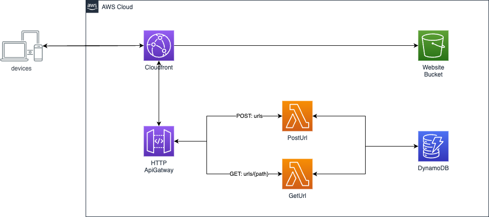

# 🌩️ serverless-web-hosting in AWS Cloud

In **serverless-web-hosting** project, I will demonstrate two different solutions about hosting web application in AWS Cloud. This project does not cover all necessary points which you might need for your app running on production like Route53, WAF, Cognito etc because of lack of time. It will however give you well defined skeleton of IaC, where you can start with it for your base of your project.

The React Application in this project is based on [url-shotener-frontend-ts](https://github.com/aditya-singh9/url-shotener-frontend-ts). Special thanks to [adity](https://www.adityasingh.tech/) ❤️

# Tasks

During this tasks in serverless-web-hosting, we introduce two major different architecture patterns to host web appliction in aws cloud. We will begin with building a web applictaion (Url-Shortner) without cloud integration (Subtask 1). Then you have 2 different subtasks to deploy your RESTful API in aws cloud with different architecture patterns.

# Prerequisite

- Frontend Application with React + Typescript
- API Specification
- docker-compose.yml

## ✅ Subtask 1 - dockerized web application


> In this subtask, your goal is to build a RESTful API service with your choosen language. Any AWS cloud services are not required in this task.

- Build RESTful API with your preferred language

- Define Dockerfile for your API

- Connect your API with given frontend application

At the End, you should be able to start docker container locally and your web application should work with your local api and local DynamoDB instance.

### 🔥 Start Application Locally

```
docker compose up
```

- DynamoDB will be hosted in port 8000
- API service will be hosted in port 8080 (for differnt port, please adjust Dockerfile)
- React Web Application will be hosted in port 3000

# 🚀 Migration to AWS Cloud

## ✅ Subtask 2: Serverless - ApiGateway + Lambda

### ✨ Architecture



> First way to migrate is using ApiGateway, Lambda, DynamoDB and Cloudfront. It's very classic way to provision serverless web application in AWS Cloud. ApiGateway has rich features that reduce effort of developers. Developer can fully concentrate on writing business logic in lambda function. In this subtask, your goal is to deploy your RESTful API into AWS Cloud with API Gateway and deploy web application with Cloudfront and S3 Bucket.

- Define Infrastructure to provision your AWS Services into AWS Cloud. You could use terraform or cdk as you choose.

- Modify your RESTful API from Subtask 1 to be lambda function handler. Lambda function supports Java, Go, PowerShell, Node. js, C#, Python, and Ruby. If you haven't used one of those languages in Subtask 1, you must modify your code with given language to provision your code lambda function.

At the End, you should be able to open the cloudfront default domain and your web application should behave exactly same like Subtask 1

## ✅ Subtask 3: Serverless - ALB + ECS + Fargate

### ✨ Architecture


> Second and the last way to migrate your web application in this task to AWS Cloud is using ALB, ECS, Fargate, Dynamodb and Cloudfront. It has advantages that developer can actully ship their container images to AWS Cloud directly without refactoring your functions. It's fast way to migrate to AWS using this pattern especially, because our on-premise app was mostly built with Docker container. It has more complexity in Infrastructure and requires fixed amount of cost becuase of NAT Gateway. **But this pattern is highly recommended for big scale web application to handle much bigger traffic than free tier limit.** It will show then extrem differences in cost comparing to ApiGateway approach. In this subtask, your goal is to deploy your RESTful API into AWS Cloud with ECS Fargate Service and deploy web application with Cloudfront and S3 Bucket.

- Define Infrastructure to provision your AWS Services into AWS Cloud. You could use terraform or cdk as you choose.

- Modify your RESTful API from Subtask 1 to be lambda function handler. Lambda function supports Java, Go, PowerShell, Node. js, C#, Python, and Ruby. If you haven't used one of those languages in Subtask 1, you must modify your code with given language to provision your code lambda function.

At the End, you should be able to open the cloudfront default domain and your web application should behave exactly same like Subtask 1

## 🤔 Differences?

Yes, from the complexity of the architecture to pricing. Both architecture give you different output. Correct answer does not exist without knowing usecase. But in general, I would love to suggest each pattern for this usecase.

❓ **cost effective + fast development from beginning?**

✅ ApiGateway and Lambda Functions. If you have to deliver this web app in short period time. AND if your traffic is unknown and mostly very smaller at the beginning.

❓ **highly scailable application for big platform?**

✅ ApiGateway and ECS could be used for this case. But in perspectiv of price, apigateway could be way more expensive to handle many traffics. [api-gatway vs alb](https://serverless-training.com/articles/save-money-by-replacing-api-gateway-with-application-load-balancer/)

## 👀 References

1. ☁️ [aws-workshop](https://containers-cdk-react-amplify.ws.kabits.com/)

2. ⚡ [ECS Fargate Application](https://exanubes.com/blog/ecs-fargate-deployment)

3. 🐱‍💻 [url-shotener-frontend-ts](https://github.com/aditya-singh9/url-shotener-frontend-ts)

4. 🐱‍💻 [URL Shortener With Go by Abhishek Gupta](https://betterprogramming.pub/build-a-serverless-url-shortener-with-go-ca198cb4d627)
