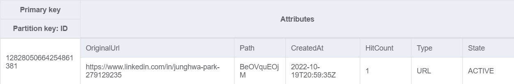
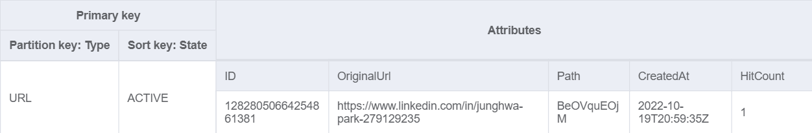

# docker-url-shortener-app

## 💡 Description

Usecase of the url shortener is to reaplace original domain to easily typable and user friendly short url, in order to display this url with clients inside/outside of the application.


- First, enter the url, which you want to shorten in input field.

- Second, click the generated url, it will redirect you to the original url.

## ✅ Requirements

- [Git](https://git-scm.com/book/en/v2/Getting-Started-Installing-Git) installed
- [Go](https://go.dev/doc/install) installed
- [Docker](https://www.linkedin.com/feed/update/urn:li:activity:6997864787439140864/) installed

## ✨ DynamoDB

DynamoDB Schema is quiet simple. Capability of this table is to hold 1:1 relation between original url and generated short url. As analysis purpose I have added hitCounter attribute, which will be counted up everytime, when user requested to retrieve original url from DynamoDB. Id Key is saved using hashed value in DynamoDB, so there will be only one entry for each url.

### Main Table



### GSI Table



## 🚀 Start Application Locally

```
docker compose up
```

- DynamoDB will be hosted in port 8000
- API with go-fiber application will be hosted in port 8080
- React Web Application will be hosted in port 3000

1. Health Check with Get Call

```
curl --location --request GET 'http://localhost:8080/urls'
```

2. Create your fancy Url with Post (you can replace the url in form data)

```
curl --location --request POST 'http://localhost:8080/urls' \
--form 'url="https://www.linkedin.com/in/junghwa-park-279129235"'
```

This Post call will return you an object with ID, Url and Path. Copy the Path value for next step.

3. Open Browser and Test your Url

```
http://localhost:8080/urls/<PATH_VALUE_FROM_STEP2>
```

4. Your url will be redirected to the original Url, which you have created in step 2.

## 👀 References

1. ☁️ [url-shotener-frontend-ts](https://github.com/aditya-singh9/url-shotener-frontend-ts)
