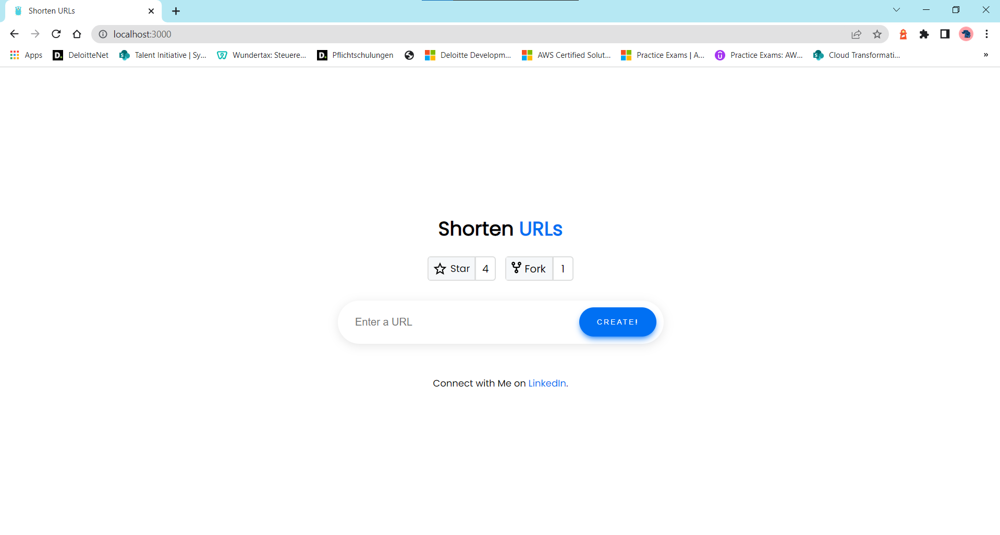
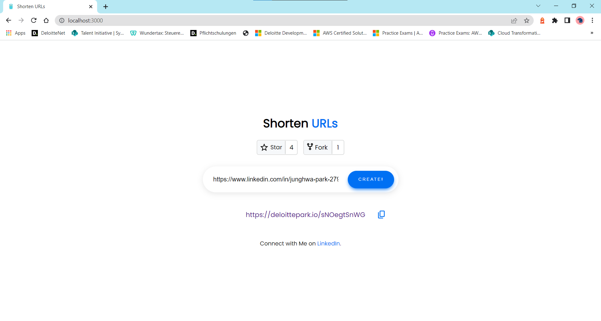
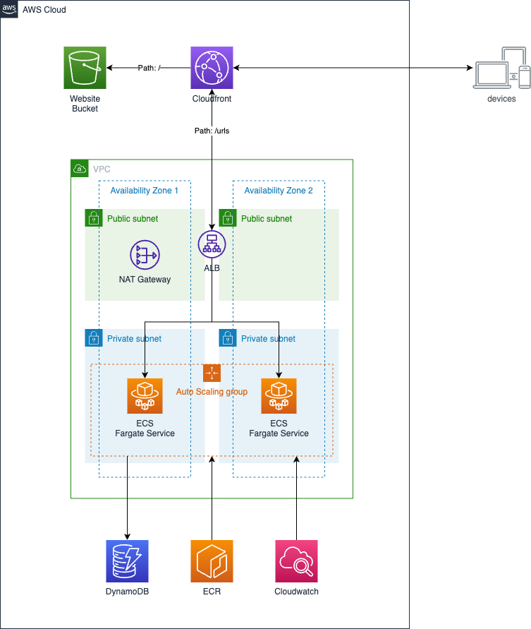

# ecs-url-shortener

## 💡 Description

Usecase of the url shortener is to reaplace original domain to easily typable and user friendly short url, in order to display this url with clients inside/outside of the application.

- First, enter the url, which you want to shorten in input field.

- Second, click the generated url, it will redirect you to the original url.

## ✅ Requirements

- [Git](https://git-scm.com/book/en/v2/Getting-Started-Installing-Git) installed
- [Docker](https://www.linkedin.com/feed/update/urn:li:activity:6997864787439140864/) installed
- [Node and NPM](https://nodejs.org/en/download/) installed
- [AWS account](https://portal.aws.amazon.com/gp/aws/developer/registration/index.html)
- [AWS CLI](https://docs.aws.amazon.com/cli/latest/userguide/install-cliv2.html) installed

## ✨ Architecture

For migration to AWS of containerized app application, I have chosen to host web application using cloudfront and backend api in ecs. Since react application needs a dynamic runtime config file to fetch the api endpoint after deployment, I have used custom resource lambda function to write runtime-config.json to S3 Frontend Asset Bucket during Deployment. [learn more](https://github.com/deloittepark/aws-serverless-golang/tree/main/cognito-react-runtime-config)

## 👀 References

1. ☁️ [aws-workshop](https://containers-cdk-react-amplify.ws.kabits.com/)

2. ⚡ [ECS Fargate Application](https://exanubes.com/blog/ecs-fargate-deployment)

3. 🐱‍💻 [url-shotener-frontend-ts](https://github.com/aditya-singh9/url-shotener-frontend-ts)
