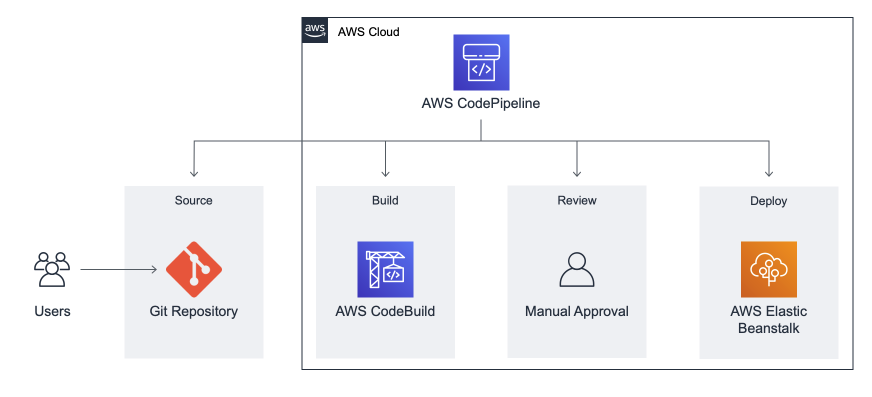
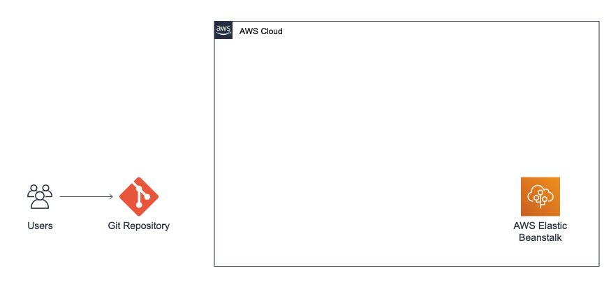
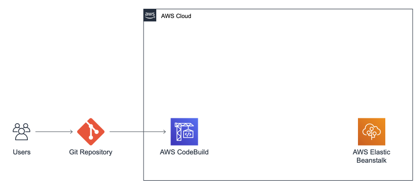
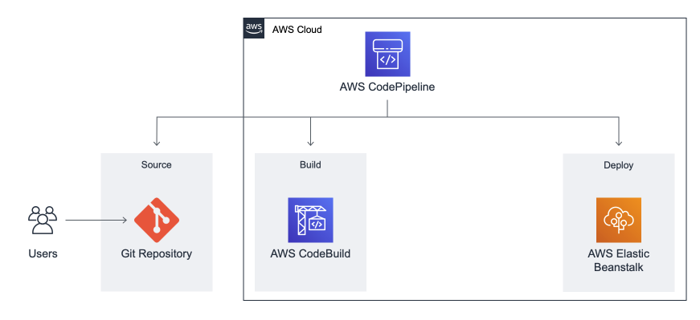

# 🌩️ continuous-delivery-pipeline in AWS Cloud

In **continuous-delivery-pipeline** project, we will be creating a continuous delivery pipeline in AWS. Pipelines are a cruial part of almost every project.


*The Architecure you will be building*

# ⭐️ Scenario: Implementing an AWS Continuous Delivery Pipeline

In a real-world business setting, the implementation of an AWS Continuous Delivery Pipeline is a strategic move to automate, standardize, and enhance the software deployment process. This scenario outlines the steps and objectives for creating such a pipeline to streamline software development and deployment.

# Tasks

The continuous-delivery-pipelin task is going to be split up into *4 subtasks*. **Subtask 1:** You will begin by altering the *app.js* file and pushing the changes to your repository. **Subtask 2:** Next step is the deployment of the application into the AWS Elastic Beanstalk Service. Next you will create a build project in AWS Codebuild. **Subtask 3:** Following this you will create the actual pipeline which will be building and deploying your application automatically using AWS CodePipeline. **Subtask 4:** Finally you will finalize the Pipeline by adding a manual approval step (which are important to have) and testing the pipeline.

# Prerequisites

- Create GitHub Account
- Clone the following repo to your machine:
[CTSE-General/aws-elastic-beanstalk-express-js-sample](https://github.com/CTSE-General/aws-elastic-beanstalk-express-js-sample.git)

# 🚀 Setup a Web-App using ElasticBeanstalk

## ✅ Subtask 1 - elastic beanstalk web application


*Current Architecure*

> In this subtask, your goal is setup an ElasticBeanstalk Application.

- Edit App.js to your liking

- Deploy App into ElasticBeanstalk

At the end, you should be able to access your web application via the given Domain in your ElasticBeanstalk environment.

### 🛠️ Adjust App.js

Inside of the App.js edit the text in the following line to something different:
```
app.get('/', (req, res) => res.send('**<CHANGE THIS STRING>**'));
```

Next push your changes into the repository using:
```
git add app.js
git commit -m "change message"
```

Now it is time to configure an ElasticBeanstalk App:
- Create as **Web server environment**
- Application name: **"<YOUR_NAME>_aws-hands-on"**
- Node.js as Platform
- Select Next
- Use the existing service role 'aws-elasticbeanstalk-service-role'
- As your EC2 instance profile choose 'aws-elasticbeanstalk-ec2-role' (if not available choose the default one or create a new one)
- Choose Skip to review & Submit

You have successfully created an App in ElasticBeanstalk! You can test your App by clicking into your environment and opening the 'Domain'

# 🚀 Laying the foundation for the Pipeline

## ✅ Subtask 2: Create Build Project

### ✨ Architecture


*Current Architecure*

> In this task you will create a CodeBuild Project which will be used to build the source code that is located inside of the given GitHub Respository. AWS CodeBuild is a fully managed continuous integration service that compiles source code, runs tests, and produces software packages that are ready to deploy.

- Create a build project with AWS CodeBuild

- Set up GitHub as the source provider for a build project

- Run a build on AWS CodeBuild

First step is to setup CodeBuild. For this navigate to the AWS CodeBuild Service. For the setup perform the following steps:

- Project Name: <YOUR_NAME>-aws-hands-on-cbp
- Select GitHub as the Source Provider and choose the training repo
- Select Amazon Linux 2 as OS
- Select Standard Runtime
- Select aws/codebuild/amazonlinux2-x86_64-standard:3.0 Image

Next you will be creating a Buildspec file for your buildspec project. For this perform the following steps:

- Select Insert build commands
- Choose switch to editor
- Write the buildspec file

Write the buildpsec file with the following config:
- Version 0.2
- add only a build phase
- add npm installation command to the build phase
- add artifacts and set the *'files'* attribute to: - '**/*'

Now you can procees by clicking 'Create build project'. In your dashboard you can now test your Codebuild Project by selecting 'Start build'.

## ✅ Subtask 3: Creating the Continuous Delivery Pipeline

### ✨ Architecture


*Current Architecure*

> The main element of this task is the Continuous Delivery Pipeline. You are going to set up a continuous delivery pipeline with source, build, and deploy stages. The pipeline will detect changes in the code stored in the training GitHub repository, build the source code using AWS CodeBuild, and then deploy your application to AWS Elastic Beanstalk.

- Creating an AWS CodePipeline

- Adding a source stage

- Adding a build stage

- Adding a deploy stage

To create your first CodePipelin navigate to the AWS CodePipeline Service and create a new pipeline with the following configuration:
- Pipeline Name: <YOUR_NAME>-aws-hands-on-pipeline
- Select 'New service role'
- Choose next

Next up is the creation of the **source stage**:
- choose **GitHub Version 1** as the Source provider
- connect your GitHub and choose your repository and select the main branch
- Confirm that GitHub Webhooks is selected
- Choose next

The second stage we are going to add is the **build stage**:
- Choose **AWS CodeBuild** as the Build Provider
- Select the Europe (Ireland) Region (eu-west-1)
- select build-<YOUR_NAME> as the project name
- choose next

Last but not least it is time to add the **deploy stage**:
- choose **AWS Elastic Beanstalk** as the Deploy Provider
- Select the Europe (Ireland) Region (eu-west-1)
- Select your previously created environment
- Choose next & Create pipeline

Now that you pipeline is setup you should be able to execute your pipeline and see the first deployment running through.

## ✅ Subtask 4: Finalizing + Testing

### ✨ Architecture


*Final Architecure*

> Now we will finalize and test the newly created Continuous Delivery Pipeline.

- Creating a review stage

- Test Pipeline

To create the review stage perform the following:
- Edit your Pipeline
- Choose 'Add Stage' between the Build and Deploy stages
- Use Stage name: 'Review' and add the stage
- Add an action group to the stage
- Action name: **Manual_Review** and select **Manual approval**
- Choose save twice

Now you have successfully setup a manual approval stage.
The last thing we are going to do is to test the functionality of the created pipeline. For that we are going to change the text inside of the App.js file once again and then pushing the changes to our repo. The change can again be a simple change of the display message.
After you have commited and pushed your changes the pipeline should automaitcally get triggered.

Monitor the pipeline and approve the manual step once it is reached. As soon as the deploy stage is done you can navigate to your ElasticBeanstalk Environment and verify that the changes were applied by opening your Domain.

# ⭐️ Bonus Task
In case you are done faster than expected and you found this too easy you can implement, the whole infrastrucutre you have built, in code. For that use a Cloud9 Environment.

## 👀 References

1. ☁️ [AWS Create Continuous Delivery Pipeline](https://aws.amazon.com/getting-started/hands-on/create-continuous-delivery-pipeline/?ref=gsrchandson)

## 💬 Contact

### Teams
If you have any questions please post them into the ['Questions' channel](https://teams.microsoft.com/l/channel/19%3a9fe1a35bb12141d58fc4c36e7522b929%40thread.tacv2/Questions?groupId=e52a6778-7228-4517-97ef-f77bcba7b4de&tenantId=36da45f1-dd2c-4d1f-af13-5abe46b99921) in Teams. We will answer your questions as soon as possible.

### Direct contact
1. Jun Cho - jcho2@deloitte.de
2. Junghwa Park - junghwpark@deloitte.de
