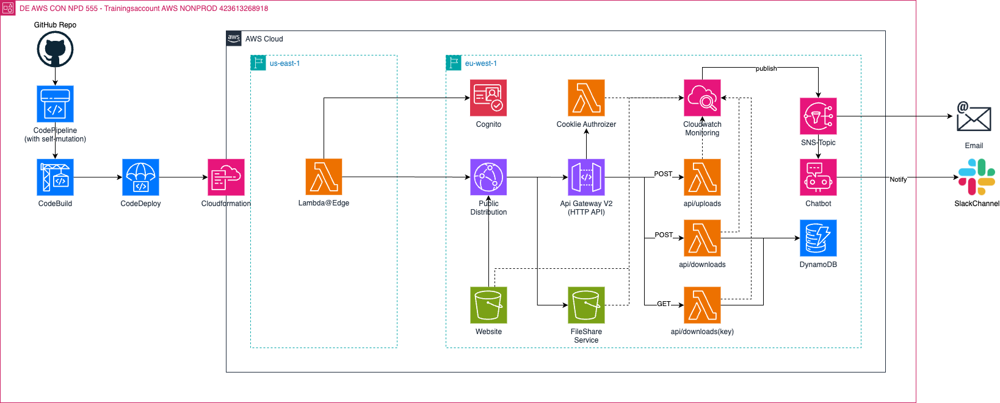

# AWS Serverless File Share Service

## ✅ Used AWS Services
🌩️ Lambda Functions

🌩️ HTTP API Gateway

🌩️ S3 Bucket for FileShare Service Website

🌩️ S3 Bucket for Shared Files

🌩️ Cloudfront Distributions

🌩️ Edge@Lambda - Viewer Request Handler

🌩️ DynamoDB

🌩️ Cognito

# ⭐️ Scenario: Serverless File Sharing on AWS
Picture a dynamic consultancy firm where remote teams constantly exchange vital project data, reports, and collaborative resources. The existing file-sharing infrastructure lacks cohesion, leading to delays and data accessibility issues. Your task is to craft a serverless file-sharing system on AWS, offering seamless, secure, and scalable data exchange. This solution will empower teams across various locations to instantly access, share, and collaborate on essential documents. Your goal is to design a solution that ensures smooth access, version control, robust security, and effortless data backups. Imagine the impact: increased efficiency, smoother workflows, and enhanced collaboration across the organization.

## 💡 Description 
Goal of the application is to share your assets in s3 with your client in secure way. Many companies have restriction of sharing data via email and email supports upto **25MB**, which is too small for business needs.

Using this application, you could share your assets from your s3 bucket with your client over your web application securely via access key.

## ✅ Requirements 
* [Git](https://git-scm.com/book/en/v2/Getting-Started-Installing-Git) installed
* [Go](https://go.dev/doc/install) installed
* [Node and NPM](https://nodejs.org/en/download/) installed
* [AWS account](https://portal.aws.amazon.com/gp/aws/developer/registration/index.html)
* [AWS CLI](https://docs.aws.amazon.com/cli/latest/userguide/install-cliv2.html) installed
* GitHub Repository Created
* Slack Account + Workspace created (optional)

# Task
>The task is divided into **3 Subtasks**. You are going to write and deploy a **file sharing infrastrucutre** in code. You can choose between **AWS CDK** or **Terraform**. For the Lambda Functions use any of the available languages (recommended: *NodeJs or Golang*). The infrastructure will be deployed using a **CI/CD Pipeline**.The UI and the Database schema are given and must be incorporated accordingly. Once done verify that the files are being transmitted. After this set up **Monitoring** for the Lambda Functions and S3-Buckets. Create alarms that when set off send a notification to either Slack using Chatbot or Email. If time is left write **documentation**.

ℹ️ **Info** You have to create your own Slack Workspace in case you want to implement the Slack Solution. If you want to implement the E-Mail solution it is advised to use your private E-Mail because if you use the Deloitte E-Mail the Mails will end up in quarantine.

## ✨ Architecture

- Lambda Edge is supported only in us-east-1 region. That's why we have to create a edge authenticator lambda function in this region. 

- Feel free to use the typescript library for this task [cognito-at-edge](https://github.com/awslabs/cognito-at-edge)

- A Cloudfront distribution has two origins. One is used for http api gateway and the other for the web application origin.

- Lambda Authorizer is attached to http apigateway to validate the idToken

- Tokens are provided by Edge@Lambda function after sign in and it's values are saved in browser cookie with **httpOnly** flag.

- Web Application will attach cookie values in request header using **withCredentials** flag securely and send request to API.

- Once the user is authenticated via cognito, they can access the api over distribution's domain.

## ✨ DynamoDB
DynamoDB Schema is quiet simple. Capability of this table is to hold 1:n relation between original path and pre-signed url of this asset. 

### Entity Structure

**PK** :Path of asset in s3 bucket

**SK**: ULID

**AccessKey**: Secret key to access pre-signed url of the asset

**CreatedAt**: timestamp of creation time

**ExpiringAt**: timestamp of expiring time (60 min after creation)

**AccessedAt**: accessed timestamp of pre-signed url

**AccessedBy**: cognito user id, who accessed pre-signed url over web application to download the file

**Filename**: Filename of the asset e.g. sample.pdf

**Url**: Pre-signed get url

3. Get Config - returns user information (username and role)
```
Method: GET
Endpoint: api/downloads
Header: {Authorization: idToken}
```

# Subtask 1

>Write the CI/CD Pipeline in AWS using infrastructure as code (AWS CDK or Terraform) and connect your GitHub Repository. The Pipeline should have self mutation enabled meaning, that if changes are made to it, it will automatically apply them without the need to redeploy the pipeline manually.
The Pipeline will be used for deployment into the AWS Account.

# Subtask 2

>Now it is time to create the core of the architecture. Implement the architecture as shown below. Use the pipeline from Subtask 1 to deploy your code.
Make sure that the architecure is secure and following best practices.
For the lambda functions choose any language available (recommended: NodeJs or Golang).

# Subtask 3

>To finalize the architecture you are going to setup monitoring using the AWS Cloudwatch Service. Create Alarms, LogGroups, etc. as you deem necessary and collect to most importatnt information in a Dashboard.
Also create notifications in case an alarm is triggered by sending the alarm message via E-Mail, Slack or both.

ℹ️ **Info**
If you want to send notifications using Slack you have to create your own Slack Account and create your own Workspace. If you choose the E-Mail approach it is recommended to use your private E-Mail as Deloitte will quarantine the notitifcation E-Mails.


## 👀 References

☁️ [cognito-at-edge](https://github.com/awslabs/cognito-at-edge)

☁️ [cloudfront-authorization-at-edge](https://github.com/aws-samples/cloudfront-authorization-at-edge)

☁️ [aws-blog-cloudfront-authorization-edge](https://aws.amazon.com/blogs/networking-and-content-delivery/authorizationedge-using-cookies-protect-your-amazon-cloudfront-content-from-being-downloaded-by-unauthenticated-users/)

☁️ [aws-s3-presigned-url](https://docs.aws.amazon.com/AmazonS3/latest/userguide/using-presigned-url.html)

☁️ [cloudfront-CORS](https://advancedweb.hu/how-cloudfront-solves-cors-problems/)

☁️ [secure-cognito-login-flow](https://advancedweb.hu/how-to-secure-the-cognito-login-flow-with-a-state-nonce-and-pkce/)